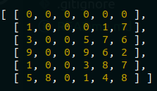

# Frontend Clearcode intern summer 2019 tasks

## Task 1

In this folder you can find solution of the HTML/CSS task. 

### Task

The task was to create the simple toolbal, using only HTML and CSS.

### Solution

That is how my toolbar look like:

## Task 2

In this folder you can find solution of the Javascript task. In `example.js` there is riddleSolver function, `main.js` is just for testing the function. 

### Task

Task requirements in brief: 

- Write a function that will receive a two-dimensional array of integers in range
[1, 1000].
- The numbers of columns and rows should be in range [3, 50].
- If there are three or more of the same integers adjacent vertically or
horizontally, "remove" them from the board.
- Removed integers are represented by the value 0. If an empty space has
integers on top of itself, drop integers until they hit a non-zero value or the
very bottom of the board.
- The function should be repeated until there are no integers left to be removed. After that, a stable board should be returned.

### Solution

The solution is as simple as possible. I'm checking if there are any three or more same number in row, if there are they are removed and replaced by numbers above, then the same check for columns. Checking is being done in while loop as long as anything is changing.

#### Example

#### Call

Example call of the function can be found in `main.js`.

##### Arguments

- board -> two dimensional array

Below there is a example of the matrix which  is a param of `riddleSolver` function:

#### Result

